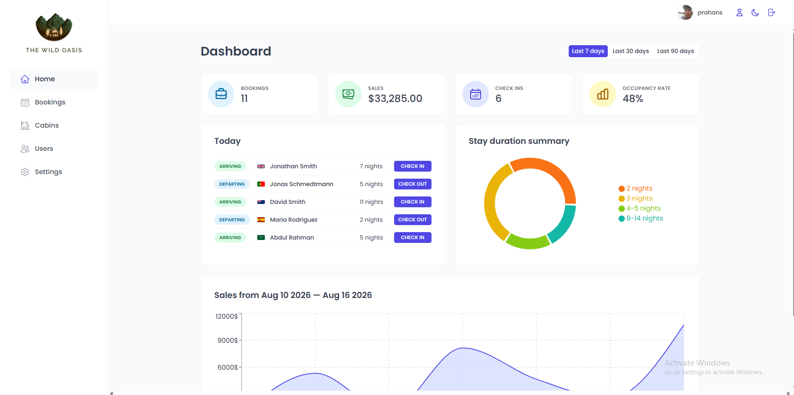
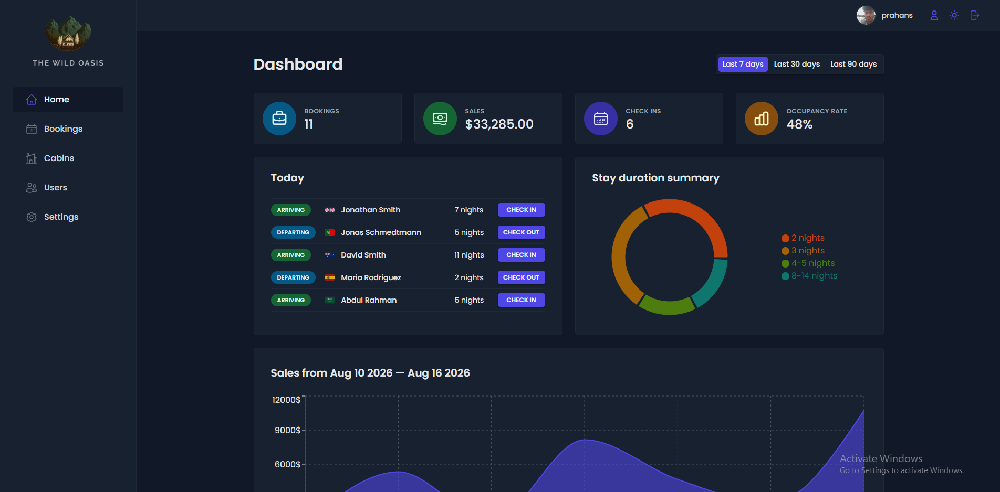
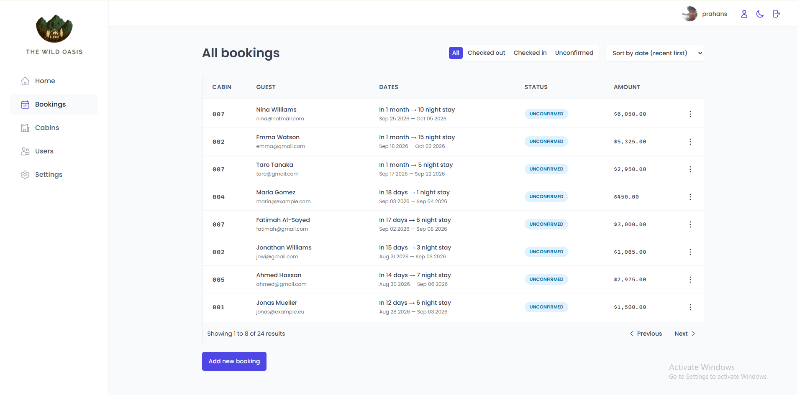
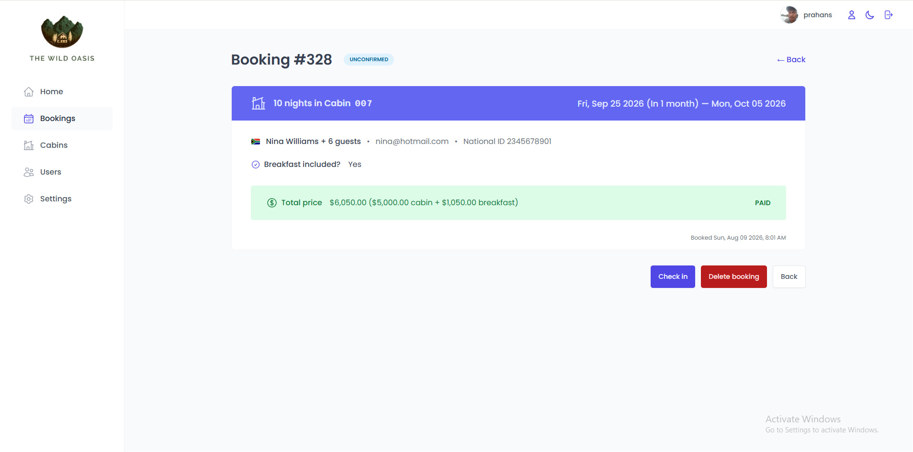
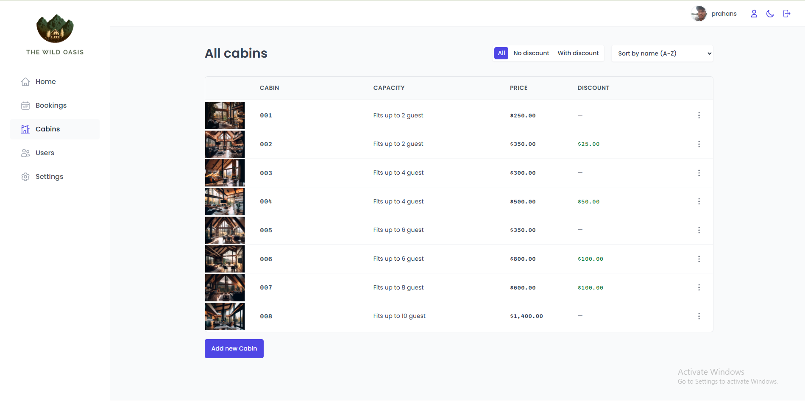
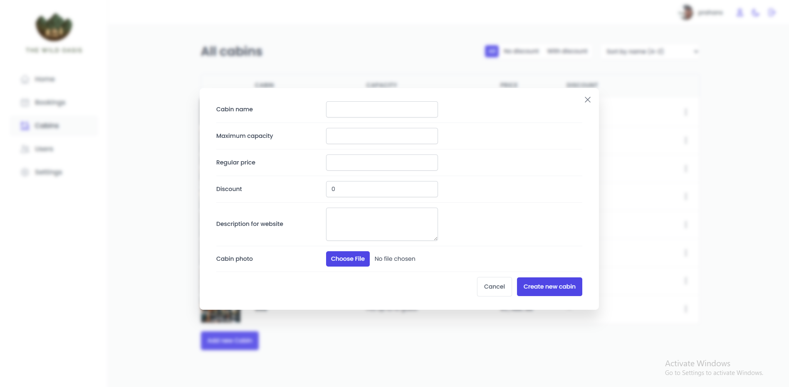
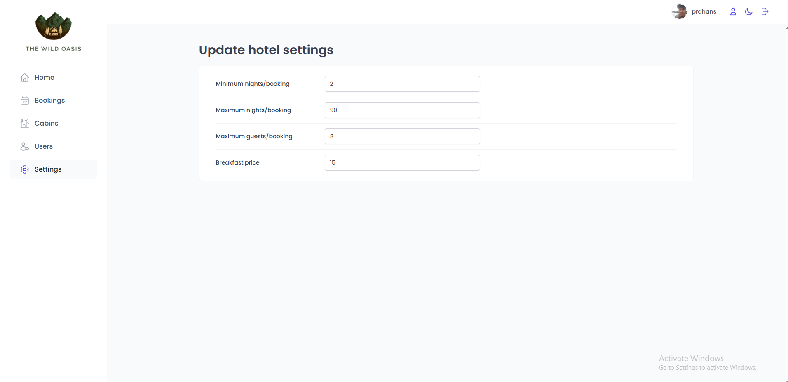
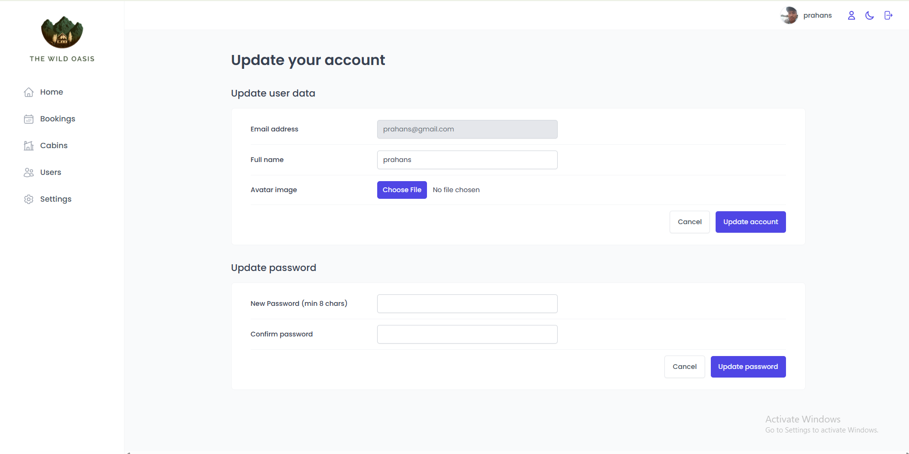
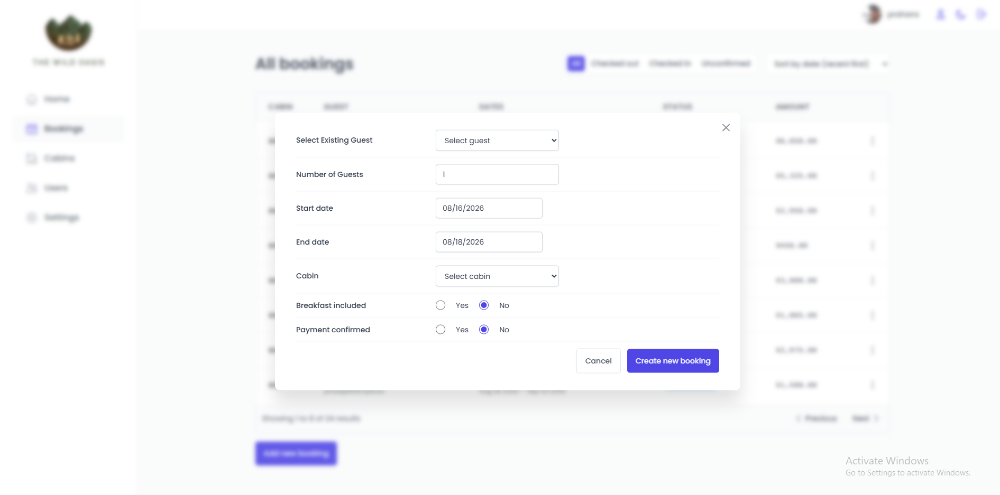
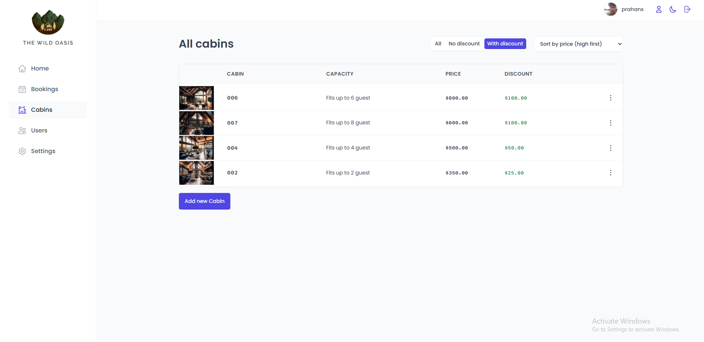

# The-wild-oasis

The Wild Oasis is a modern cabin booking and management application built with React. It provides an admin dashboard for managing cabins, guests, bookings, and other aspects of a cabin business.

## 🚀 Live Demo

[the-wild-oasis-prahans.netlify.app](#)

## 📸 Screenshots

## 📸 Screenshots

### Dashboard

<table>
  <tr>
    <td></td>
    <td></td>
  </tr>
</table>

### Bookings

<table>
  <tr>
    <td></td>
    <td></td>
  </tr>
</table>

### Cabins

<table>
  <tr>
    <td></td>
    <td></td>
  </tr>
</table>

### Other Screens

<table>
  <tr>
    <td></td>
    <td></td>
  </tr>
  <tr>
    <td></td>
    <td></td>
  </tr>
</table>

## ✨ Features

- 🔐 User authentication
- 🏕️ Create, update, and delete cabins
- 📅 Manage cabin bookings and reservations
- 👤 Manage guest information
- 📊 Dashboard with business statistics
- 🔎 View and filter bookings
- 🌙 Dark mode support
- 📱 Responsive user interface
- ⚡ Fast and interactive UI
- ☁️ Persistent data storage with Supabase

## 🛠️ Tech Stack

### Frontend

- React
- React Router
- React Query
- Styled Components
- React Hook Form
- Recharts

### Backend / Services

- Supabase
- Supabase Authentication
- PostgreSQL

### Development Tools

- Vite
- ESLint
- Git & GitHub

## 📁 Project Structure

```text
the-wild-oasis/
├── public/
├── src/
│   ├── components/
│   ├── data/
│   ├── features/
│   ├── hooks/
│   ├── pages/
│   ├── services/
│   ├── styles/
│   ├── ui/
│   ├── utils/
│   ├── App.jsx
│   └── main.jsx
├── .gitignore
├── package.json
├── vite.config.js
└── README.md
```

## ⚙️ Getting Started

### 1. Clone the repository

```bash
git clone https://github.com/YOUR_USERNAME/the-wild-oasis.git
```

### 2. Navigate to the project

```bash
cd the-wild-oasis
```

### 3. Install dependencies

```bash
npm install
```

### 4. Configure environment variables

Create a `.env` file in the root of the project:

```env
VITE_SUPABASE_URL=your_supabase_url
VITE_SUPABASE_KEY=your_supabase_key
```

Replace the values with your own Supabase project credentials.

### 5. Start the development server

```bash
npm run dev
```

The application should now be available at:

```text
http://localhost:5173
```

## 🗄️ Database

The application uses **Supabase** as its backend service and PostgreSQL database.

Supabase handles:

- Authentication
- Database storage
- Cabin data
- Guest information
- Bookings
- Application data

## 🔑 Authentication

Users can authenticate through the application's authentication system.

Authenticated users can access the management dashboard and perform administrative operations such as managing cabins and bookings.

## 📊 Dashboard

The dashboard provides an overview of the cabin business, including:

- Recent bookings
- Today's activities
- Occupancy information
- Sales and revenue statistics
- Booking trends

## 🏕️ Cabin Management

Administrators can manage cabins through the dashboard.

Available operations include:

- Create cabins
- Update cabin information
- Delete cabins
- View cabin details
- Manage cabin pricing and capacity

## 📅 Booking Management

The booking system allows administrators to:

- View reservations
- Filter bookings
- View booking details
- Update booking status
- Manage guest information

## 🧠 What I Learned

This project helped me strengthen my understanding of:

- Building reusable React components
- Managing server state with React Query
- Managing application state
- React Router and nested routes
- Authentication and authorization
- Form handling and validation
- Connecting React applications to Supabase
- Working with PostgreSQL-backed applications
- Building reusable UI components
- Creating responsive dashboards
- Data visualization with charts
- Structuring a larger React application

## 🧩 Architecture

The project follows a feature-oriented structure that separates application concerns and keeps components reusable and maintainable.

The main areas of the application include:

```text
UI
│
├── Pages
├── Features
├── Reusable Components
│
└── Services
    └── Supabase
        └── PostgreSQL
```

## 🚧 Future Improvements

Some potential improvements include:

- Add automated tests
- Improve accessibility
- Add more advanced booking filters
- Add additional dashboard analytics
- Improve mobile experience
- Add automated notifications
- Improve error handling and loading states

## 👨‍💻 Author

**YOUR NAME**

- GitHub: [@prahans](https://github.com/prahans)
- LinkedIn: [https://www.linkedin.com/feed/](#)

## 📄 License

This project is for educational and portfolio purposes.
